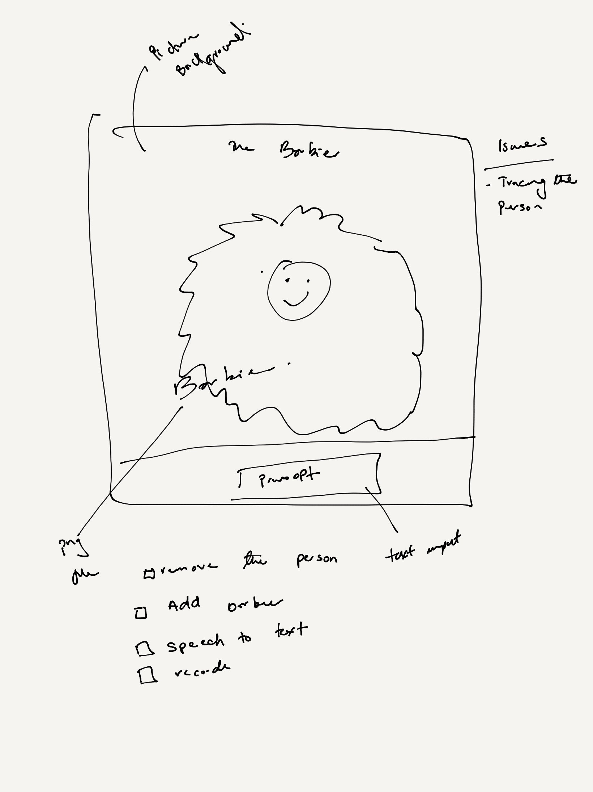
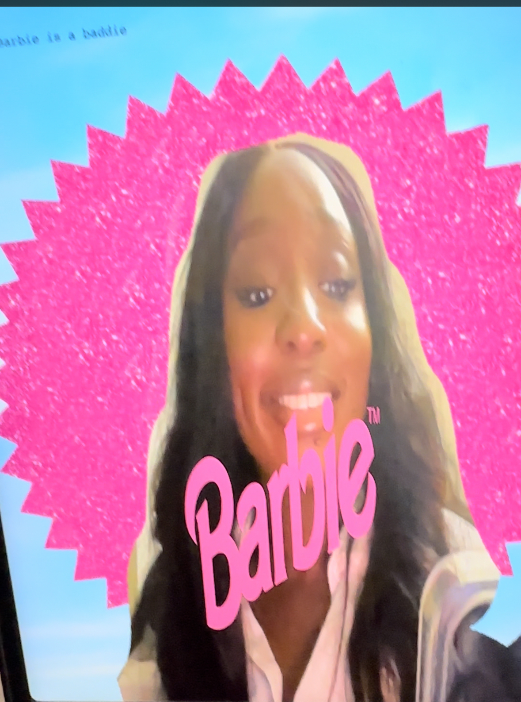
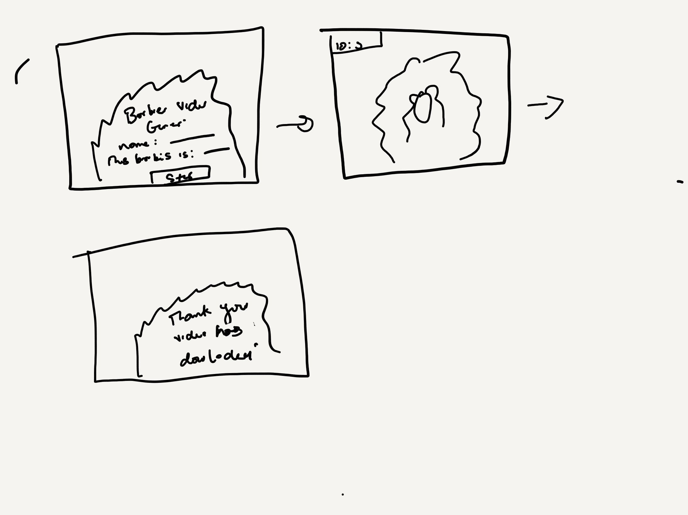

## Introduction 

Hi my name is Bunmi, I am a multi displinary technologist and I love making immersive experiences and things in general. 
This readme details my attempt at making a p5 js barbie filter/gif maker 
it is mostly for me to document my journey while detailing how I made the app 

For reference with the release of the new barbie movie coming out on  21 July 2023 staring Margot Robbie. Barbie released 
these set of posters

So I thought it might be fun to make a personalized video/gif version that people can download. 

## Idea

My initial idea was to have the below user journey
- User goes to page
- Enters thier barbie feature 
- Hits record and saves video
  

[//]: # (![idea sketch 1]&#40;img/initial_idea.jpg&#41;)

## Exploration Phase

I was curious about how to cut out the background of the video and replace with the barbie background and i found this simple way of doing this 
by applying a threshold to the video pixels to differentiate the background from the persons image as seen here 

[P5 js code reference for using threshold for background removal](https://editor.p5js.org/lisajamhoury/sketches/zdx7KtsTM)

[Tutoroal explaining how p5 js pixels work](https://idmnyu.github.io/p5.js-image/Filters/index.html)

I also found these methods using open cv 
[Blog post on backgound removal examples using open CV](https://www.freedomvc.com/index.php/2022/01/17/basic-background-remover-with-opencv/#:~:text=Background%20Remover%20with%20OpenCV%20%E2%80%93%20Method%201&text=Perform%20Gaussian%20Blur%20to%20remove,a%20mask%20of%20the%20foreground)

This methods where not as clear as I would like, so I went into looking at A.I methods

[How to use A.I background remover in JS](https://michael-holstein.medium.com/remove-background-from-person-by-using-ai-and-javascript-eb85674f9e8d)

the model mentioned in the above was also avaliable in ml5js a ml library for P5 js

[ML5](https://ml5js.org/community/)

However I need to so some smoothing iof the edges suggested [here](https://v-hramchenko.medium.com/how-to-cut-out-a-person-in-an-image-with-open-source-projects-e5e7f8798d5c)

Other things I researched 
- was how to record the video
https://editor.p5js.org/lisajamhoury/sketches/JMSVEKmx8
- how to have the text moving
https://editor.p5js.org/pippinbarr/sketches/bjxEfpiwS

## Segmentation Model

I first started with the 

#### BodyPix Model
The [bodypix](https://npm.io/package/@tensorflow-models/body-pix) is used to segment an image into pixels that are and are not part of a person. 
The model can either be MobileNetV1 or ResNet architecture.  
- The [ResNet architectures](https://datagen.tech/guides/computer-vision/resnet/) improves on CNN architectures which are not able to scale to a large number of layers hence limited performance due to “vanishing gradient"
This ResNet architectures introduces “skip connections”. ResNet stacks multiple convolutional layers, skips those layers, and reuses the activations of the previous layer. 
The Skipping speeds up initial training by compressing the network into fewer layers.
- The [MobileNet architecture](https://towardsdatascience.com/understanding-depthwise-separable-convolutions-and-the-efficiency-of-mobilenets-6de3d6b62503#:~:text=Introduction%3A,known%20as%20Depthwise%20Separable%20convolution.) that is much faster as well as a smaller model that makes use of a new kind of convolutional layer, known as Depthwise Separable convolution

[//]: # (![body pix model result]&#40;img/bodypix_result.jpeg&#41;)

#### UNET Model
I decided to switch to the [UNET](https://learn.ml5js.org/#/reference/unet) which is a segmentation model  developed for biomedical image segmentation at the Computer Science Department of the University of Freiburg, Germany.[ref](https://towardsdatascience.com/unet-line-by-line-explanation-9b191c76baf5)

The network is based on a fully convolutional network whose architecture is modified and extended to work on fewer training images and achieve more precise segmentation. [ref](https://medium.com/@CereLabs/understanding-u-net-architecture-for-image-segmentation-74bef8caefee) 
In this network, an image is converted into a vector and then the same mapping is used to convert it again to an image. This reduces the distortion by preserving the original structure of the image. 
unlink traditional CNN where the image is converted into a vector which is largely used in classification problems.[ref](https://aditi-mittal.medium.com/introduction-to-u-net-and-res-net-for-image-segmentation-9afcb432ee2f#:~:text=In%20CNN%2C%20the%20image%20is,original%20structure%20of%20the%20image.)

## Final flow 
so after I tested this can work. I  can up with the below final flow, excuse the sketch was on a short timeline line.

[//]: # (![Final flow sketch]&#40;img/Final_flow_sketch.png&#41;)

### File formats

The final conflict of this project was saving the output video. The file formats avaliable with P5 JS were 
- [webm](https://www.webmproject.org/about/) is an open, royalty-free, media file format designed for the web.
- [GIF](https://en.wikipedia.org/wiki/GIF)
- [MP4](https://en.wikipedia.org/wiki/MP4_file_format)

As seen in this example code referenced - https://editor.p5js.org/doriclaudino/sketches/LgLw5UaBr 

I decided to go with a gif format as it was the easiest to convert and the format is easier to access on mobile phones.

## Assets
I also explored making my own barbie assets using adobe tools and found this [tutorial](https://www.youtube.com/watch?v=oMGhyVoi4Fg&t=705s&ab_channel=Nucly%E2%80%A2PhotoshopandCreativeDesignTraining)

# Running Project
set up python server
`python -m http.server`

If task is not killed properly
`lsof -i tcp:8000`
`kill -9 PID`

## Things to improve
- Turning off the webcam before and after the gif is recorded, the video capture still runs behind the scences
- 